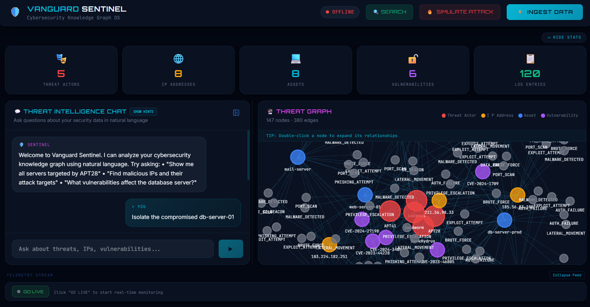
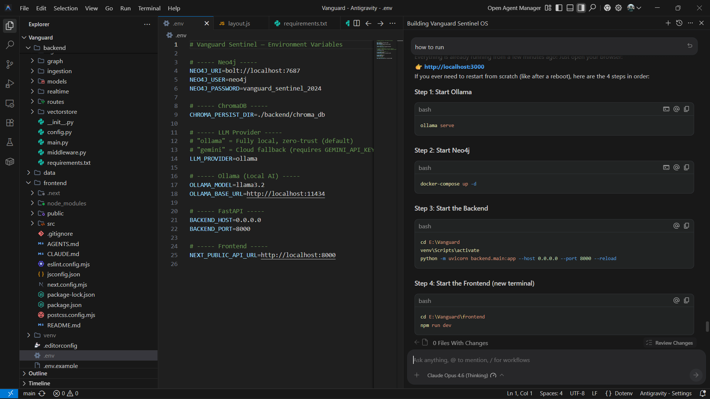

<div align="center">
  
# Vanguard Sentinel



### Open Source Knowledge-First Data OS for Cybersecurity

*A lightweight, locally-hosted alternative to Palantir Foundry & AIP — built for Cybersecurity Log Analysis and Threat Detection.*

[](LICENSE)
[](https://python.org)
[](https://nextjs.org)
[](https://neo4j.com)
[](https://github.com/Dhy4n-117/Vanguard/actions)
[](CONTRIBUTING.md)
[](SECURITY.md)

</div>

---

## Overview

Vanguard Sentinel ingests raw server logs, extracts cybersecurity entities (Threat Actors, IPs, Assets, Vulnerabilities), builds a knowledge graph in **Neo4j**, enables semantic search via **ChromaDB**, and exposes a natural-language **GraphRAG** query interface powered by **LangChain + local AI (Ollama)** — all wrapped in a cyberpunk-inspired glassmorphism frontend.



---

## ✨ Features

### Core Platform
- **📊 Interactive Threat Graph** — 2D force-directed visualization with node filtering, detail inspection panel, and PNG export.
- **💬 Agentic Security Actions** — Issue commands to "Isolate" assets or calculate "Blast Radius" via natural language chat.
- **🔥 Attack Playbook Templates** — 5 predefined attack scenarios (APT28, Ransomware, Insider Threat, DDoS, Supply Chain) with multi-stage visual timelines.
- **🧠 Advanced GraphRAG** — Recursive path traversal logic to visualize complex threat chains automatically.
- **🏠 Zero-Trust Local AI** — Runs on `llama3` or `qwen2.5` (for low-RAM machines) via Ollama.

### Visualization & Analytics
- **📈 Analytics Dashboard** — Full-screen analytics view with severity distribution charts, top targeted assets, node type breakdown, attack frequency sparklines, and threat actor activity tables — all built with pure Canvas/SVG.
- **🌐 Network Topology Map** — Zone-based network layout (External → DMZ → Internal → Data Layer) with color-coded bezier connection paths and smart node classification.
- **🔍 Semantic Log Search** — Vector-based search modal over raw log text via ChromaDB.
- **⏱️ Threat Timeline** — Chronological horizontal timeline of security events for incident sequencing.

### Security Operations
- **🚨 Real-Time Toast Notifications** — Critical/high severity events trigger cyberpunk-styled alert toasts in real-time.
- **📋 Incident Report Generator** — Backend endpoint + one-click frontend download that compiles current graph state into a structured Markdown incident report.
- **🔴 Live Attack Simulator** — Visual multi-stage attack demonstrations (Port Scan → Brute Force → Exfiltration) with graph diffing support.
- **🔎 Graph Filtering** — Dynamic filter chips to show/hide specific node types (Threat Actors, IPs, Assets, Vulnerabilities, Log Entries).
- **🗂️ Node Detail Panel** — Slide-out glassmorphism sidebar with full node metadata, connection summaries, and expansion actions.

### Developer Experience
- **⌨️ Keyboard Shortcuts** — `Ctrl+K` search, `Ctrl+Shift+A` attack playbooks, `Ctrl+B` toggle chat, `?` to view all shortcuts.
- **🧭 Sidebar Navigation** — Expandable/collapsible icon sidebar with quick access to Dashboard, Analytics, Topology, Playbooks, Report, and Shortcuts.
- **🛡️ Error Boundaries** — React error boundaries per panel, so a crash in one component won't take down the whole dashboard.
- **📱 PWA Support** — Installable web app with manifest.json and theme configuration.
- **🔒 CI/CD Pipeline** — GitHub Actions workflow for frontend lint/build, backend validation, and dependency security audits.

---

## Architecture

```
┌─────────────────────────────────────────────────────────────┐
│  Frontend (Next.js + Tailwind CSS + react-force-graph-2d)   │
│  ├── SidebarNav          → Navigation pillar                │
│  ├── GraphPanel          → Force-directed threat graph      │
│  ├── ChatPanel           → Agentic AI chat interface        │
│  ├── AnalyticsDashboard  → Charts & metrics overlay         │
│  ├── NetworkTopology     → Zone-based network map           │
│  ├── AttackPlaybooks     → Predefined attack scenarios      │
│  └── KeyboardShortcuts   → Global hotkey system             │
├─────────────────────────────────────────────────────────────┤
│  Backend (Python FastAPI)                                   │
│  ├── Ingestion Pipeline (Log Parser → Entity Extractor)     │
│  ├── GraphRAG Engine (LangChain + Ollama/Gemini)            │
│  ├── Report Generator (Incident Report API)                 │
│  ├── Real-Time Simulator (WebSocket Event Stream)           │
│  └── REST API Layer                                         │
├─────────────────────────────────────────────────────────────┤
│  Data Layer                                                 │
│  ├── Neo4j Community Edition (Docker) — Knowledge Graph     │
│  └── ChromaDB (Embedded) — Vector Store                     │
└─────────────────────────────────────────────────────────────┘
```

---

## Tech Stack

| Layer          | Technology                              |
|----------------|-----------------------------------------|
| **Frontend**   | Next.js 15, Tailwind CSS, react-force-graph-2d |
| **Backend**    | Python 3.11+, FastAPI, Uvicorn          |
| **Graph DB**   | Neo4j Community Edition (Dockerized)    |
| **Vector DB**  | ChromaDB (embedded, local persistence)  |
| **AI/LLM**     | LangChain, Ollama (local) or Gemini (cloud)|
| **Embeddings** | sentence-transformers (all-MiniLM-L6-v2)|
| **CI/CD**      | GitHub Actions                          |

---

## Project Structure

```
Vanguard/
├── .github/workflows/       # CI/CD pipeline
│   └── ci.yml               # Lint, build, security audit
├── docker-compose.yml       # Neo4j container
├── .env.example             # Environment template
├── .editorconfig            # Code style enforcement
├── CONTRIBUTING.md          # Contributor guide
├── SECURITY.md              # Vulnerability policy
├── backend/                 # FastAPI server
│   ├── main.py              # App entry point
│   ├── config.py            # Settings
│   ├── middleware.py         # Logging & security headers
│   ├── models/              # Pydantic schemas & ontology
│   ├── ingestion/           # Log parsing & loading
│   ├── graph/               # Neo4j client & queries
│   ├── vectorstore/         # ChromaDB client
│   ├── agentic/             # LangChain GraphRAG pipeline
│   ├── realtime/            # WebSocket manager & simulator
│   └── routes/              # API endpoints
│       ├── ingest.py        # Data ingestion
│       ├── query.py         # GraphRAG queries
│       ├── graph.py         # Graph data retrieval
│       ├── search.py        # Semantic search
│       ├── stream.py        # Live event streaming
│       ├── pipeline.py      # Full pipeline orchestration
│       └── report.py        # Incident report generation
└── frontend/                # Next.js app
    ├── public/
    │   └── manifest.json    # PWA manifest
    └── src/
        ├── app/             # Pages & layouts (SEO configured)
        ├── components/      # 20+ UI components
        │   ├── GraphPanel           # Force-directed graph + filters
        │   ├── ChatPanel            # AI chat interface
        │   ├── AnalyticsDashboard   # Charts & metrics
        │   ├── NetworkTopology      # Zone-based network map
        │   ├── AttackPlaybooks      # Attack scenario selector
        │   ├── SidebarNav           # Navigation sidebar
        │   ├── KeyboardShortcuts    # Global hotkeys
        │   ├── ErrorBoundary        # Crash isolation
        │   ├── LoadingSkeleton      # Shimmer placeholders
        │   ├── ToastNotification    # Real-time alerts
        │   ├── ThreatTimeline       # Event chronology
        │   ├── NodeDetailPanel      # Node inspection sidebar
        │   └── GraphFilters         # Node type filtering
        ├── hooks/           # Custom React hooks
        └── lib/             # API client utilities
```

---

## Prerequisites

- **Docker Desktop** — for running Neo4j
- **Python 3.11+** — for the backend
- **Node.js 18+** — for the frontend
- **Ollama** — for local AI ([Install](https://ollama.com)), then run `ollama pull llama3`

---

## Quick Start

```bash
# 1. Clone the repo
git clone https://github.com/Dhy4n-117/Vanguard.git
cd Vanguard

# 2. Set up environment
cp .env.example .env
# No API keys needed — Ollama runs locally by default

# 3. Start Neo4j
docker-compose up -d

# 4. Start the backend
cd backend
python -m venv venv && venv\Scripts\activate  # Windows
pip install -r requirements.txt
uvicorn main:app --reload --port 8000

# 5. Start the frontend
cd frontend
npm install
npm run dev
```

Open [http://localhost:3000](http://localhost:3000) to access the dashboard.

---

## ⌨️ Keyboard Shortcuts

| Shortcut | Action |
|----------|--------|
| `Ctrl + K` | Open semantic search |
| `Ctrl + Shift + A` | Open attack playbooks |
| `Ctrl + Shift + I` | Trigger data ingestion |
| `Ctrl + B` | Toggle chat panel |
| `Ctrl + Shift + S` | Toggle stats bar |
| `Escape` | Close all modals |
| `?` | Show shortcuts overlay |

---

## API Endpoints

| Method | Endpoint | Description |
|--------|----------|-------------|
| `GET` | `/api/health` | Service health check |
| `POST` | `/api/ingest` | Ingest and parse log data |
| `POST` | `/api/query` | GraphRAG natural language query |
| `GET` | `/api/graph` | Fetch full graph data |
| `POST` | `/api/search` | Semantic vector search |
| `POST` | `/api/stream/start` | Start live event simulator |
| `POST` | `/api/stream/stop` | Stop live event simulator |
| `POST` | `/api/stream/simulate-attack` | Trigger attack burst |
| `GET` | `/api/report/generate` | Generate incident report |

---

## Contributing

We welcome contributions! Please read the [Contributing Guide](CONTRIBUTING.md) before submitting a PR.

## Security

For reporting vulnerabilities, please see our [Security Policy](SECURITY.md).

## License

MIT — see [LICENSE](LICENSE) for details.

---

<div align="center">
  <sub>Built with 🛡️ by the Vanguard team</sub>
</div>
